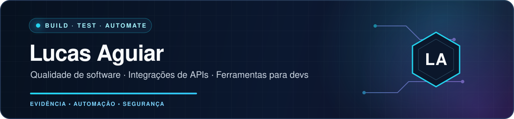

  

  
  
  

  Desenvolvo ferramentas, automações e integrações voltadas à <strong>qualidade de software</strong>,
  à <strong>produtividade técnica</strong> e à <strong>segurança operacional</strong>.

  Meu portfólio reúne aplicações em Python e Node.js, workflows com n8n, testes automatizados
  e ferramentas desktop construídas com TypeScript, React e Electron.

<!-- Posicionamento profissional a definir em revisão futura. -->

## O que eu construo

<table>
  <tr>
    <td width="50%" valign="top">
      <h3>⚙️ Automação</h3>
      
Workflows com n8n, integrações entre serviços e ferramentas para reduzir trabalho operacional repetitivo.

    </td>
    <td width="50%" valign="top">
      <h3>🧪 Qualidade</h3>
      
Testes unitários, de integração e E2E, com atenção a cenários negativos, bordas e comportamento observável.

    </td>
  </tr>
  <tr>
    <td width="50%" valign="top">
      <h3>🔌 Integrações</h3>
      
APIs, webhooks e conectores para Jira, Freshdesk, Slack, ServiceNow, Azion e ferramentas baseadas em MCP.

    </td>
    <td width="50%" valign="top">
      <h3>🛡️ Segurança operacional</h3>
      
Redação de dados sensíveis, rollback, validação de integridade e decisões críticas verificáveis.

    </td>
  </tr>
</table>

## Stack em uso

  
  
  
  
  
  
  
  

`Express` · `EJS` · `pytest` · `unittest` · `node:test` · `Vitest` · `SQLite` · `pandas` · `Git` · `JSON` · `CSV`

## Projetos selecionados

> Os repositórios abaixo estão privados no momento. Os links serão disponibilizados individualmente após solicitação.

<table>
  <tr>
    <td width="50%" valign="top">
      <h3>🧩 Prompt Forge</h3>
      
Ferramenta local para estruturar prompts e orquestrar ferramentas assistidas por IA, com arquitetura MVC/Services e histórico em SQLite.

      
<code>Python</code> <code>Streamlit</code> <code>SQLite</code> <code>pytest</code>

    </td>
    <td width="50%" valign="top">
      <h3>⚙️ Requests Automations</h3>
      
Automação para consultar e consolidar tickets Jira e Freshdesk, com aplicação Streamlit, cache, retries e workflows n8n para triagem operacional.

      
<code>Python</code> <code>Streamlit</code> <code>n8n</code> <code>Jira/Freshdesk APIs</code>

    </td>
  </tr>
  <tr>
    <td width="50%" valign="top">
      <h3>🔗 Jira Issue Analyzer</h3>
      
Consulta e análise estruturada de issues do Jira Cloud, incluindo JQL, paginação, segurança HTTP e testes automatizados.

      
<code>Node.js</code> <code>Express</code> <code>Jira REST API</code> <code>Helmet</code>

    </td>
    <td width="50%" valign="top">
      <h3>🛡️ Clean Git Commit</h3>
      
Aplicação desktop para identificar, remover e restaurar artefatos antes de commits Git, com SHA-256, rollback, quarentena e proteção contra symlinks.

      
<code>TypeScript</code> <code>React</code> <code>Electron</code> <code>Vitest</code> <code>Playwright</code>

    </td>
  </tr>
</table>

## Como eu trabalho

- **Automação com rastreabilidade:** comportamento observável e reproduzível.
- **Segurança por padrão:** falhas, limites de API e dados sensíveis tratados explicitamente.
- **Arquitetura pragmática:** separação entre integrações, regras de negócio e interfaces.
- **Qualidade verificável:** fluxos positivos, negativos e casos de borda.
- **IA com supervisão:** decisões críticas continuam testáveis e auditáveis.

  

